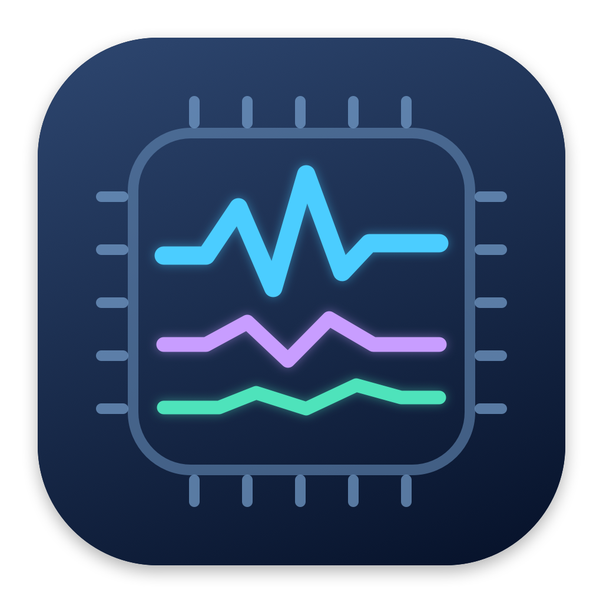

# MacVitals



原生 macOS 菜单栏系统监控应用，支持 macOS 13 及以上版本。普通指标无需第三方依赖或管理员权限；CPU/GPU 频率与芯片功耗需要安装管理员采集服务。

## 使用

构建后将 `dist/MacVitals.app` 复制到“应用程序”文件夹。双击 MacVitals，菜单栏使用固定宽度的两行布局：上行 CPU 和内存，下行下载和上传速度，宽度约 154 点。点击打开深色监控面板，点击外部、切换应用或按 Esc 即关闭：蓝色 CPU、紫色内存、绿色风扇实时曲线展示最近两分钟数据；实时网速使用蓝色下载、橙色上传曲线，下方显示交换空间、磁盘剩余容量、电池状态、温度传感器和开机运行时间。曲线在面板关闭后仍持续采样，历史只保存在内存中，退出后清空。风扇曲线显示当前可读取风扇的最高转速；没有数据时显示不可用。

在菜单中启用“登录时启动”即可随登录启动。自行构建后请将 `dist/MacVitals.app` 复制到 `/Applications` 再运行。如果系统要求批准，请在系统设置 → 通用 → 登录项中允许。首次 CPU 采样显示省略号，下一次刷新后显示利用率。

面板右上角齿轮菜单中可以选择 1、2、5、10 秒刷新，默认 2 秒；退出也在菜单内。应用不显示 Dock 图标。

## 详情

点击顶栏图标 → 面板右上角“详情”，打开可调整大小的系统详情窗口。分组可展开或折叠，默认展开系统、内存、磁盘、电池、风扇和 GPU。关闭窗口后可再次打开。

详情每 5 秒在后台采样，包含：

- 系统、芯片、核心数、CPU 用户/系统占用、负载均值、热状态。
- 内存页分类、压缩器占用、文件缓存、交换空间和内存压力。
- CPU/GPU/内存/电池/存储温度候选与其他温度键；只有合理的正温度读数会展示。候选分组不证明物理位置，M5 的 Tp00 名称参考 Stats 和 iSMC 映射。
- 各活动网络接口的 IPv4、上传下载速度和系统接口计数。物理和虚拟接口可能统计同一流量，不宜相加；使用系统 64 位接口计数；计数器重置或接口更换后先重新建立基线，不显示虚假峰值。
- 主目录卷的空间、全部 IOBlockStorageDriver 的累计读写和速度。
- 电池循环次数、容量、健康估算、电压、电流、电池侧功率估算和系统剩余时间估算。健康值采用满充容量/设计容量，新电池可能超过 100%，不等同于系统设置显示的健康百分比。
- 每个风扇的当前/最低/最高转速，以及驱动提供的 GPU 利用率。
- 可读取进程的 CPU 与驻留内存前五名。进程 CPU 以单核心 100% 计，与顶栏全部核心归一化利用率口径不同。

管理员采集服务已经接入 CPU/GPU 有效频率与 CPU/GPU/ANE 功耗，另有无需管理员权限的每核 CPU 利用率。功耗是系统估算，频率为采样期间的活跃有效频率；休眠核心可能显示 0 或无活跃频率。CPU+GPU+ANE 合计不等同于整机功耗。电池侧功率是电压×电流估算，不是芯片功耗。

### 管理员采集服务

可选安装 `local.macvitals.power` LaunchDaemon，约每 5 秒执行一次固定参数的系统 `/usr/bin/powermetrics`，采集 1 秒窗口。只有检测到 MacVitals 进程时才执行实际采样；退出应用后不再调用 powermetrics。服务会随系统启动恢复。

- 服务配置：`/Library/LaunchDaemons/local.macvitals.power.plist`
- 只读采集脚本：`/Library/PrivilegedHelperTools/local.macvitals.collect-power.sh`
- 最新结果：`/var/run/local.macvitals.power/sample.plist`，原子替换，仅保留一份，不持续增长。
- 上述采集脚本及输出目录由 root 所有，应用只读取数据，不以 root 身份运行。没有全局免密 sudo 设置。
- 20 秒内没有新采样时，界面显示读数已过期，不继续显示旧功耗。

安装：在项目目录下的终端运行 `sudo /bin/sh scripts/power/install.sh`。若 macOS 阻止访问 Downloads，可先将 `scripts/power` 整个目录复制到 `/private/tmp` 后运行其安装脚本。

卸载管理员服务：运行 `sudo /bin/sh scripts/power/uninstall.sh`（受 Downloads 权限限制时，同样先复制脚本到 `/private/tmp`）。卸载后普通 CPU、内存、温度、网络等监控仍可使用，频率与功耗显示等待采集。

使用 `.build/release/MacVitals --details-diagnose` 可输出详情快照。温度/进程/接口列表只有当前可读取的项，详情历史不写磁盘。

## 构建

安装 Apple Command Line Tools 后执行：

```sh
./scripts/build.sh
open dist/MacVitals.app
```

脚本生成当前 Mac 架构的 Release 应用并进行本地 ad-hoc 签名。此签名用于本地运行，分发给其他用户需要 Developer ID 签名和公证。

## 诊断

```sh
.build/release/MacVitals --diagnose
```

诊断模式采样一次后输出实际指标并退出，不启动菜单栏界面。

使用 `.build/release/MacVitals --sensors` 可只读枚举所有 SMC 键及温度候选读数。枚举结果输出到终端，需要时可自行重定向保存。键名不能独立证明具体物理传感器的位置。

## 指标口径与限制

- CPU：两次 Mach CPU ticks 的差值，所有核心整体利用率。
- 内存：活动页 + wired 页 + 压缩器实际占用 − 可回收活动页的估算，除以物理内存。并非内存压力，也不保证与活动监视器完全一致。
- 交换空间：系统 `vm.swapusage` 的已使用字节数；未使用时显示“0 B（未使用）”，详情列出当前分配量。
- 主面板网速：单个主要物理接口的下载/上传字节增量，避免 VPN 与物理接口重复计数；默认每 2 秒更新，K/M/G 使用十进制字节单位。
- 磁盘：用户主目录所在卷的容量及系统报告的可用于重要用途的空间（可能包含可清理空间）。
- 电池：IOKit 电源信息；桌面 Mac 没有电池时显示不可用。
- 风扇：只读 AppleSMC 的 `FNum` 和 `F*Ac`，支持 fpe2 / float 转速数据；0 RPM 是有效读数。无风扇或系统未开放时明确显示相应状态。
- 温度：尝试有限的 CPU 相关 SMC key，并在读数旁标明实际 key；不同机型的传感器含义和可用性不同。尤其 Apple Silicon 机型不保证可获取温度。

SMC 是非公开硬件接口，不保证所有机型或未来系统兼容。应用不会写入 SMC，也不会修改风扇控制。

## 结构

- `Sources/MacVitals/main.swift`：菜单栏 UI、刷新设置和登录启动。
- `Sources/MacVitals/SystemMonitor.swift`：CPU、内存和其他顶栏指标采样。
- `Sources/MacVitals/MetricsSupport.swift`：host 端口生命周期和设备计数增量处理。
- `Sources/MacVitals/Details.swift`：后台详情采样与分组详情窗口。
- `Sources/MacVitals/Dashboard.swift`：彩色曲线监控面板和最近两分钟历史数据。
- `Sources/CMetrics`：只读 SMC 桥接。
- `scripts/build.sh`：生成可双击启动的 `.app`。

SMC 数据包和调用约定参考公开实现：[smcFanControl](https://github.com/hholtmann/smcFanControl)、[SMCKit](https://github.com/beltex/SMCKit)。


## 回归验证

执行 `./scripts/test.sh`（仅需 Command Line Tools，无需 XCTest），覆盖进程 CPU 时间与 `getrusage` 对照、host 端口引用释放、网络计数重置/接口更换/超过 4 GiB 的统计、磁盘热插拔时忽略新设备的历史计数、缺失内存数据状态、SMC 并发关闭与读取。CPU ticks 使用无符号增量以支持计数器回绕；进程使用 PID 和启动时间识别，避免 PID 复用。

采样器持有单个 host 端口引用并在释放时归还。SMC 调用串行保护，发生传输层失败后重新建立连接并重试一次；不存在的键不会触发反复重连。网络和磁盘对当前设备集合独立保留基线，新设备从下一次采样开始统计速度。

应用图标：`assets/AppIcon.icns`；原始预览为 `assets/AppIcon.png`，可用 `swift scripts/make-icon.swift assets/AppIcon.png` 重新生成 PNG。构建脚本自动将 ICNS 嵌入应用并签名。
