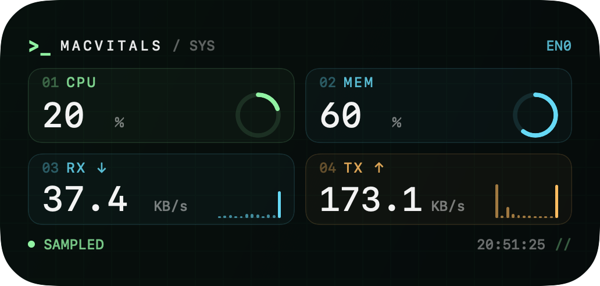

# MacVitals

A native macOS menu bar system monitor with CPU, memory, temperature, fan speed, network traffic, battery and disk telemetry instruments. Built with SwiftUI.

原生 macOS 菜单栏系统监控工具，提供实时硬件遥测仪表，以及独立的本地 AI agent 资源监控顶栏项。

## MacVitals

[MacVitals](MacVitals/) 是原生 macOS 菜单栏系统监控应用，提供 CPU 环形刻度、内存容量块、风扇转速表、温度热度刻度、镜像网络流量柱、电池电量仓和磁盘容量仪表，以及进程和芯片频率/功耗详情。


macOS 14 及以上支持原生桌面小组件，提供 CPU / 内存环形仪表和网速历史柱条。可隐藏顶栏，以小组件显示实时数据。



CPU、内存、网速固定每 2 秒采集；其他系统与 Agent 指标仅在对应页面打开且未最小化时采集。Agent 支持确认后结束实例或选中进程；芯片功耗服务也采用按需采样。

需要 macOS 13 或以上版本，以及 Apple Command Line Tools。

```sh
cd MacVitals
./scripts/build.sh
open dist/MacVitals.app
```

完整使用方法、可选管理员采集服务和测试说明见 [MacVitals 文档](MacVitals/README.md)。
