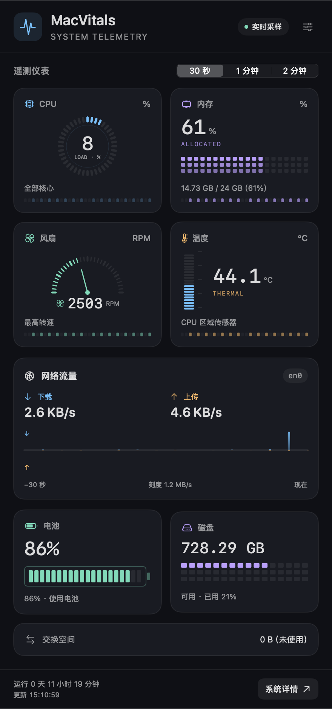

# usefulTools

一些实用工具。

## MacVitals

[MacVitals](MacVitals/) 是原生 macOS 菜单栏系统监控应用，提供 CPU 环形刻度、内存容量块、风扇转速表、温度热度刻度、镜像网络流量柱、电池电量仓和磁盘容量仪表，以及进程和芯片频率/功耗详情。



需要 macOS 13 或以上版本，以及 Apple Command Line Tools。

```sh
cd MacVitals
./scripts/build.sh
open dist/MacVitals.app
```

完整使用方法、可选管理员采集服务和测试说明见 [MacVitals 文档](MacVitals/README.md)。
